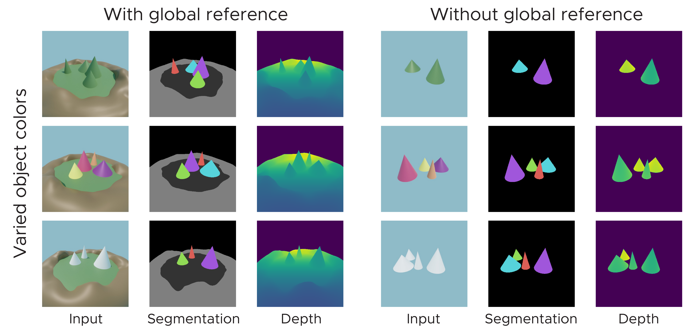

# Allocentric Scene Perception benchmark (ASP)
<p align="center">
  
</p>

This repository hosts both the ASP benchmark and a biologically plausible model for unsupervised segmentation of objects. If you use the benchmark or the model in your project please cite the following paper (published at CVPR2023):

- [Frey, M., Doeller, C.F. & Barry, C. (2023).
 Probing neural representations of scene perception in a hippocampally dependent task using artificial neural networks. arXiv preprint arXiv:1910.02058.]()

## Variations of Dataset
We provide several different versions of our dataset, varying both the color of the objects as well as changing the global reference frame. 


## Datasets:
When using the allocentric scene perception benchmark (also called asp in the code there are several dataset options: 
 - asp_surround: Uses 16 images from the scene, rendered from the outside of the environment. 
 - asp_within: Uses 16 images from the scene, rendered from the inside of the environment.

Both of these can be combined with the following options: 
 - global_COLOR: Uses the scene with the global reference frame. 
 - noglobal_COLOR: Uses the scene without the global reference frame.
 - all_COLOR: Uses snapshots from both the global and local reference frame.

COLOR can be one of `['mix', 'green', 'white']`. For example, a valid dataset option would be `asp_surround_mix_ref`. Note that the snapshots are sampled randomly surrounding the center of the environment, therefore you can not assume that the snapshots are evenly distributed around the environment.

## Dataset download

The allocentric scene perception benchmark is now part of Huggingface datasets, which we use to host the zip files (further integration coming soon). Use the following commands to download and unzip the dataset (`ASP_FixedSun.zip`). Note that we also provide two additional datasets, `ASP_RandomSunPerScene.zip` and `ASP_RandomSunPerSnapshot.zip`, which are the same as `ASP_FixedSun` but with random sun positions for each scene and snapshot respectively.

``` bash
wget https://huggingface.co/datasets/CYHSM/asp/resolve/main/ASP_FixedSun.zip
unzip ASP_FixedSun.zip
```
Then use the `--dataset_path` argument to point to the folder containing the dataset, e.g. `--dataset_path /data/ASP_FixedSun/`.

## Adapt the dataset

We provide a [Blender file](blender/asp.blend) which can be used to adapt the task and objects, including code for rendering across novel viewpoints. 

## Cite
If you use the model or benchmark in your research, please cite the work as follows: 
```

```

# Model training

## Installation instructions
Clone the environment and install the dependencies:

``` python
conda create -n neuroscenes python=3.8
conda install numpy matplotlib jupyter scipy seaborn
# Check exact command for installing pytorch here: https://pytorch.org/get-started/locally/
conda install pytorch torchvision torchaudio pytorch-cuda=11.7 -c pytorch -c nvidia
pip install wandb einops pytorch-lightning pandas
pip install tensorflow-cpu tensorflow-datasets
```

## Examples: 
The following will train the model on the asp_surround_mix_ref dataset with some of the default parameters. 
``` python
python train.py --batch_size 1 --learning_rate 0.0002 --gpus 1 --max_epochs -1 --dataset=asp_surround_mix_ref --name=asp_example1 --num_timesteps 6 --p_loss 2 --l1o_weight 0 --l1f_weight 0 --K_down 10 --transformer_layers=1 --wandb_logging=False --project='Example1' --dataset_path /data/ASP_FixedSun/
```

For full list of options see `train._parse_args`. 

# Acknowledgements
Thanks to the following open source projects for inspiration and code: 
- [Pytorch](https://pytorch.org/)
- [PyTorch Lightning](https://pytorch-lightning.readthedocs.io/en/stable/index.html)
- [GI Simone](https://gitlab.com/generally-intelligent/simone)
- [Kubric](https://github.com/google-research/kubric)
- [Cater](https://rohitgirdhar.github.io/CATER/)