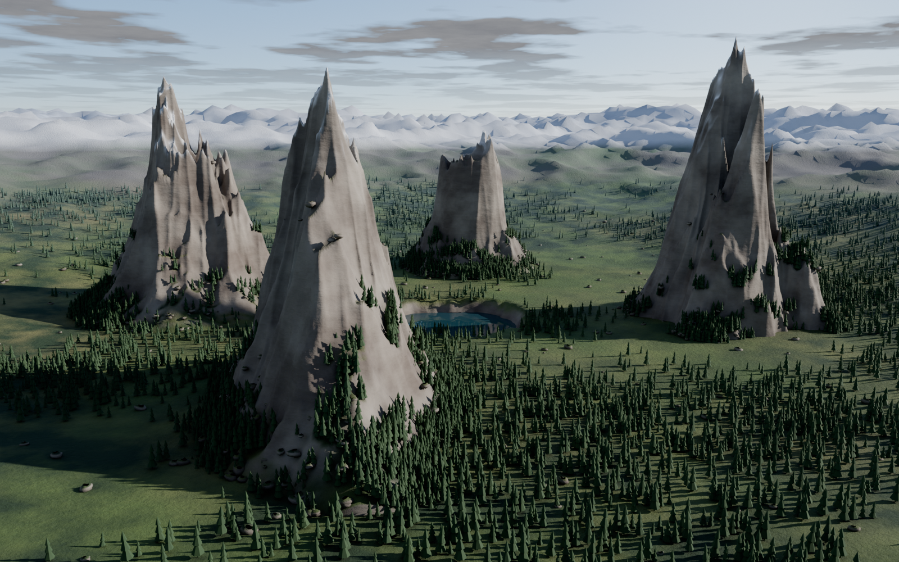
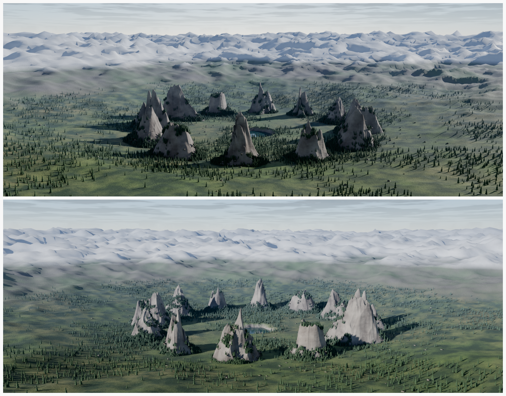
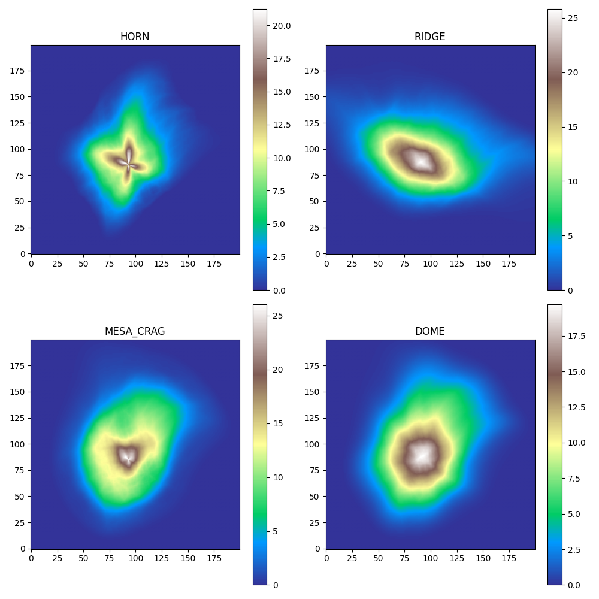

# Four Mountains Task: Procedural Alpine World & Dataset Generator

A fully procedural, photorealistic alpine environment and dataset generator for
**Allocentric Scene Perception** and the **Four Mountains Task (FMT)**, built for
**Blender 5.2+**.

The scene is a real landscape, not a set of cones on a plane: an alpine tarn in a
forested valley, layered foothills and a hazed snow range on the horizon, a
physical sky with a cumulus deck, and four freely movable landmark peaks drawn
from a library of **twelve distinct landforms**.

---

## Visual Showcase



### 1. 360 degree multi-viewpoint orbit and instance segmentation


*Top row: Cycles renders at azimuth 0/90/180/270 degrees. Bottom row:
pixel-exact instance masks. Each peak carries its own colour, its forest and
boulder field are labelled with it, and the terrain, the lake and the sky are
separate classes.*

### 2. The landform library





*All twelve morphologies at identical summit height and base radius.*

### 3. Allocentric position manipulation (distractor foils)


*Left: canonical arrangement from azimuth 45 degrees. Right: distractor foil
with M1 and M2 swapped, from the identical viewpoint. Vegetation and boulders
are parented to each peak, so a moved mountain takes its forest with it.*

---

## How the world is generated

Everything is built procedurally through `bpy` and numpy. No add-ons, no
external assets, no image textures.

### 1. Twelve landform morphologies

Each peak is a polar heightfield evaluated with domain-warped ridged
multifractal noise, then normalised so `height` is the true summit altitude and
clipped so `Z = 0` exactly at the base radius (no flat overlapping skirts, no
Z-fighting against the valley floor).

| Morphology | Landform |
| --- | --- |
| `horn` | Matterhorn-style pyramid: four razor arêtes, glacial cirques between them |
| `ridge` | Elongated massif with a knife-edge spine and a saddled crest |
| `mesa` | Flat-topped tableland: sheer cliff band under a level summit, talus apron |
| `dome` | Stratovolcano with concave-up flanks and radiating fluvial ravines |
| `caldera` | Collapsed volcano: raised, breached rim around a sunken basin |
| `butte` | Isolated rock tower on a wide debris cone |
| `twin` | Two summits of unequal height joined by a col |
| `sawtooth` | Serrated crest: a row of pinnacles and notches along one strike |
| `cuesta` | Tilted plateau: cliff scarp on one side, long dip slope opposite |
| `cone` | Symmetric ash cone with a small summit crater |
| `whaleback` | Roche moutonnée: ice-smoothed stoss side, steep plucked lee |
| `massif` | Broad complex block with several subsidiary summits |

Adding a thirteenth is one function plus one line in
`fm_morphology.MORPHOLOGIES`.

### 2. One seamless world, from the shoreline to the horizon

A single radial terrain sheet (out to 1.4 km, radially graded resolution)
carries every distance band: the carved lake basin, the valley floor, the
foothills, the mid range and the horizon skyline. Relief is **centred** rather
than piled onto a monotonic ramp, so ridges alternate with real basins and the
skyline reads as layered ridgelines instead of one continuous wall.

### 3. Slope- and altitude-driven biome shader

The terrain material stacks biomes, each overriding the previous where its mask
is 1: shore gravel -> alpine meadow (with sun-bleached patches) -> conifer belt
-> scree -> cliff rock (mineral-banded, iron-stained, stratified) -> snow. The
tree line and snow line are jittered by noise, and snow is inhibited on walls
too steep to hold it. An ambient-occlusion term darkens couloirs and crevices,
which is most of what stops a procedural mountain looking like poured concrete.

### 4. Atmosphere

- **Nishita multiple-scattering sky** with low aerosol density for a deep blue.
- **Sky-dome cumulus**: each view ray is intersected with a virtual cloud plane
  in the world shader, so clouds get true perspective from every camera angle.
  (A modelled cloud plane degenerates into a solid ceiling when viewed edge-on.)
- **Aerial perspective**: an analytic distance term in the terrain shader fades
  far ranges into the sky colour. No volumetrics, no render cost.
- **Low sun** (22 degrees) cross-lighting the canonical viewpoint, so topography
  reads in relief.

### 5. Vegetation and boulders

Conifers are scattered into clumped stands between the shoreline and the tree
line, off the cliffs; boulders are biased toward steeper ground near cliff
bases. Both are emitted in the **local frame of their host object** and parented
to it, so a mountain carries its forest and its talus when you move it.

---

## Repository structure

```
game/
├── odd_one_out.html      # browser game: three plates, 360° turntable, 2D orbital maps
└── renders/bank/
    └── manifest.json     # game metadata sidecar (camera parameters, peak coordinates)
blender/four_mountains/
├── fm_noise.py           # numpy value / fBm / ridged-multifractal primitives
├── fm_morphology.py      # the twelve landform heightfields
├── fm_materials.py       # terrain, water, foliage and sky-cloud shaders
├── fm_scatter.py         # mesh building, surface sampling, vegetation scatter
├── generate_scene.py     # scene assembly -> four_mountains.blend
├── render_dataset.py     # controller API + batch dataset renderer
├── render_game_bank.py   # batch 360° viewpoint bank renderer for the web game
├── make_figures.py       # regenerates every image in this README
└── four_mountains.blend  # self-contained saved scene
```

`fm_noise.py` and `fm_morphology.py` import no `bpy`, so every heightfield can be
generated, inspected and unit-tested with plain Python:

```python
import sys; sys.path.append("blender/four_mountains")
from fm_morphology import build_heightfield, morphology_names
X, Y, Z = build_heightfield("caldera", height=34.0, base_radius=17.0)
```

---

## Getting started

### Prerequisites

- **Blender 4.5+ or 5.0+** (developed on **5.2.1 LTS**). Apple Silicon Metal GPU
  acceleration is detected and enabled automatically.
- Python 3.10+ with numpy, Pillow and matplotlib for the figure pass.

### Build the scene

```bash
blender -b -P blender/four_mountains/generate_scene.py
```

Options (after `--`):

```bash
blender -b -P blender/four_mountains/generate_scene.py -- \
    --types horn,caldera,sawtooth,butte \
    --seed 7 --samples 128 --resolution 1600 1000
```

`--types` accepts any number of landforms; with more than four they are spread
evenly around the valley.

### Render a dataset

```bash
blender -b -P blender/four_mountains/render_dataset.py -- \
    --num_views 16 --output_dir data/four_mountains --samples 96
```

Per sample:

- `sample_XXXX_azYYY_rgb.png` — Cycles render
- `sample_XXXX_azYYY_mask.png` — instance segmentation mask
- `sample_XXXX_azYYY_meta.json` — camera pose, sun angles, peak positions,
  landform types and the mask colour legend

### Render the 360° Game Viewpoint Bank

Renders 96 photorealistic Cycles frames across the canonical valley and 3 distractor foils (24 viewpoints per valley at 15° steps) with the camera orbit elevated to 17° so all peaks remain visible:

```bash
blender -b blender/four_mountains/four_mountains.blend -P blender/four_mountains/render_game_bank.py
```

Outputs are written directly to `game/renders/bank/` along with `manifest.json`.

### Regenerate the README figures

```bash
blender -b -P blender/four_mountains/make_figures.py   # render panels
python  blender/four_mountains/make_figures.py         # compose sheets
```

---

## Python API

```python
import sys
sys.path.append("blender/four_mountains")
from render_dataset import FourMountainsRenderer

renderer = FourMountainsRenderer("blender/four_mountains/four_mountains.blend")

# Move any peak; its forest and boulder field come along
renderer.set_mountain_position("M1", x=-10.0, y=8.0, rot_z=0.4)

# Or build a distractor foil in one call
renderer.swap_mountains("M1", "M2")

# Camera orbit (azimuth degrees, elevation, radius, look-at height)
renderer.set_camera_orbit(azimuth_deg=45.0, elevation_deg=17.0, radius=94.0, target_z=6.0)

# Time of day: azimuth is the bearing the light comes from
renderer.set_sun(elevation_deg=18.0, azimuth_deg=210.0, energy=75.0)

# RGB + instance mask + metadata
renderer.render_sample(output_dir="output/", sample_idx=0, azimuth_deg=45.0)
```

`renderer.mountains` is discovered from the scene, so scenes with more than four
peaks work unchanged, and `renderer.mask_legend()` returns the class colours for
decoding the masks.

---

## Play it in the browser: Wrong Valley (Four Mountains Task)

`game/odd_one_out.html` is an interactive implementation of the Four Mountains Task powered by the **Blender Cycles 360° Viewpoint Bank**:

- **Photorealistic Cycles Raytracing**: All plates display authentic Blender Cycles renders with physical Nishita lighting, conifer forest stands, talus boulder fields, water reflections, and snow summits.
- **Fixed Constant-Radius 360° Orbit**: Camera is locked to a circular orbit at 17° elevation ($R = 94.0$, $\text{target}_z = 6.0$), ensuring all 4 landmark peaks and the central tarn remain clearly visible from every bearing without any artificial zoom variation.
- **Interactive 360° Orbit Turntable**: Drag horizontally across any plate or scrub the slider below it to rotate smoothly around that valley through all 24 angles ($0^\circ \dots 345^\circ$).
- **Orbital 2D Plan Views**: Answering reveals top-down maps showing the exact coordinates of M1 (Matterhorn), M2 (Knife Ridge), M3 (Table Mesa), and M4 (Ash Dome), the central tarn, and the camera's line-of-sight bearing.
- **Classic FMT Foils**: Foils preserve the 4 landmark shapes and alter their spatial arrangement (e.g., M1 & M2 swapped across the northern rim, M3 & M4 swapped across the southern rim, or M1 & M3 swapped).

### Launching the game

Serve the `game/` folder with Python:

```bash
python3 -m http.server 8000 --directory game
```

Then open your browser to **<http://localhost:8000/odd_one_out.html>** (or run `open game/odd_one_out.html` on macOS).

---

## Roadmap

1. **Weather and season presets** — autumn larch, winter snow line, overcast
   diffuse lighting to test invariance to shadow cues.
2. **Hydraulic erosion** — sediment transport passes for dendritic drainage and
   alluvial fans.
3. **Ground-level walkthrough camera** — first-person egocentric trajectories
   through the valley and passes.
4. **More ground truth** — 32-bit EXR depth, surface normals, optical flow for
   video sequences.
5. **Geometry-nodes instancing** for the vegetation, to trade the baked meshes
   for lighter scenes at much higher tree counts.
