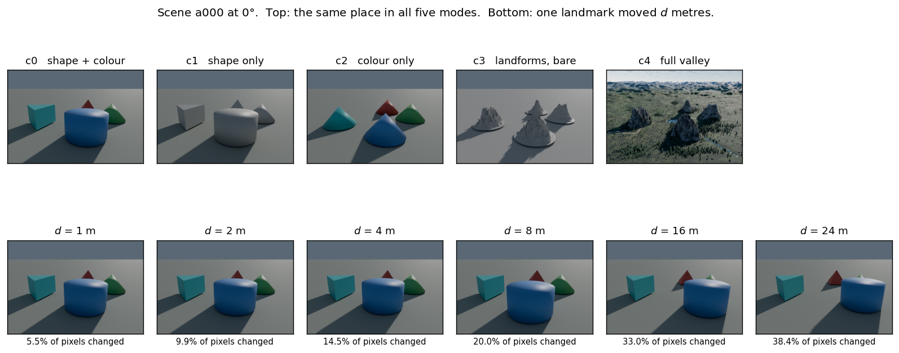

# Allocentric scene perception

**How far must the landmarks physically move to confuse a model as much as
walking 45° around the scene does?**

That distance, in metres, is the number this repository measures, and **small
is the good end** — a model that survives the turn pays little for it, so a
small displacement suffices to match the cost. It separates
the two reasons two images of a place can differ — *the place changed* or *you
moved* — and puts them in the same units so they can be traded against each
other.

**→ [`BENCHMARK.md`](BENCHMARK.md) is the specification**: the design, the scene
distance, λ, how to run it, and what must hold before a number is read.

---

## The dataset in one line

One set of scene layouts, rendered five ways. Scene `a007` in `c0` and in `c4` is
the same place from the same spot; only the cues that tell landmarks apart, and
the world around them, differ. Each anchor scene also carries a **probe ladder**
— the same scene with one landmark displaced 1, 2, 4, 8, 16, 24 m.



## The landmarks are a parametric shape space

A landform is a six-number **form** vector plus a size and a pose:

| attribute | range | what it does |
|---|---|---|
| `peak_angle` | 0.70–2.00 | sharp summit … straight cone … broad-topped |
| `flank` | 1.15–2.60 | flared into a talus apron; above 1 the surface meets the ground tangentially, so there is no crease at the base |
| `offset` | 0.00–0.20 | summit displacement, as a fraction of width |
| `crest` | 0.00–0.55 | summit ridge length, as a fraction of width |
| `roughness` | 0.10–0.55 | relief amplitude |
| `ruggedness` | 0.55–1.70 | relief frequency |

Form is separable from size, which is what lets identity be varied without
touching apparent size — and apparent size is the image's distance cue. In this
dataset size is held **uniform across every landmark and every mode**, so a
landmark is the same landmark in all five renders.

`fm_peak.shape_distance` is a metric on the normalised form space, and
`sample_distinct_forms` enforces a minimum separation so that two landmarks in
one scene are never confusable.

## Repository

```
blender/four_mountains/
├── fm_layout.py        scene layouts, framing validity, camera geometry
├── fm_peak.py          the parametric landform shape space
├── fm_scenedist.py     d_pos / d_bind / d_id, and probe sampling
├── fm_bank.py          what is in the bank — no Blender, so it is testable
├── fm_stimulus.py      the five modes; builds a scene for any of them
├── render_bank.py      the only renderer
├── render_dataset.py   camera orbit, appearance, instance masks
├── generate_scene.py   the alpine world used by c4
├── fm_geom/noise/materials/scatter.py   terrain and vegetation
└── fm_text.py          textual channels (L1/L2/L3)

bench/
├── metrics.py          cross-view retrieval, NVM, RSA
├── exchange.py         λ — the metres-per-degree read-out
├── merge_bank.py       joins shards AND checks the dataset
├── figure_dataset.py   Figure 1
├── backends.py         frozen-encoder and generative model adapters
├── prompts.py          the question a generative model is asked
└── tests/              121 tests

paper/main.tex          the write-up
```

## Getting started

```bash
pip install -e .
pytest bench/tests

# render one mode (repeat for c0..c4)
blender -b -P blender/four_mountains/render_bank.py -- \
    --out data/scenes/c0_shape_colour --mode c0_shape_colour

# merge, check, look, score
python bench/merge_bank.py --root data/scenes
python bench/figure_dataset.py --root data/scenes --out figures/fig1_dataset.png
python bench/exchange.py --bank data/scenes/c0_shape_colour --model <timm id>
```

Rendering needs Blender 5.2 with Cycles and a CUDA GPU; scoring needs `timm` and
`torch`. See [`CLUSTER.md`](CLUSTER.md) for the multi-GPU setup.

## Status

The dataset and the λ read-out are built and tested. **There is currently no
4-alternative forced-choice arm**: it was tied to the previous bank schema and
has not been rebuilt against this one, so there is no human-comparable number and
no VLM/LLM path at the moment.
