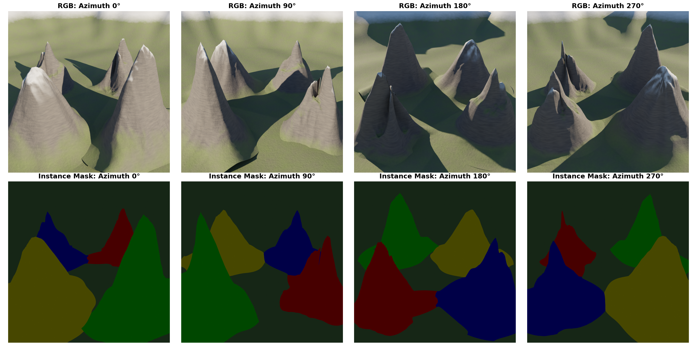
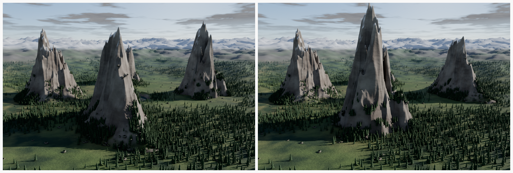

# Four Mountains Task: Procedural 3D Environment & Dataset Generator

A photorealistic, fully procedural 3D alpine environment and dataset generator built for **Allocentric Scene Perception** and the **Four Mountains Task (FMT)** in **Blender 5.2+**.

This repository is dedicated to procedural scene generation, flexible viewpoint synthesis, allocentric object manipulation, and automated ground-truth data collection (RGB, depth, and instance segmentation masks).

---

## Visual Showcase

### 1. 360° Multi-Viewpoint Orbit & Instance Segmentation
The scene features four geomorphologically distinct mountain peaks positioned in an alpine valley surrounded by a continuous 360° mountain horizon:



*Top Row: Photorealistic Cycles renders across 4 cardinal viewpoints ($0^\circ, 90^\circ, 180^\circ, 270^\circ$). Bottom Row: Pixel-accurate ground-truth instance segmentation masks ($M_1$ Red, $M_2$ Green, $M_3$ Blue, $M_4$ Yellow, Landscape Dark Green).*

---

### 2. Allocentric Position Manipulation (Distractor Foils)
In cognitive neuroscience, the Four Mountains Test evaluates allocentric spatial memory by testing whether an observer can recognize the same mountain arrangement from a novel viewpoint while rejecting distractor foils with altered spatial configurations.

The Python API enables instant coordinate translations of any mountain peak to generate controlled distractor foils:



*Left: Canonical mountain configuration seen from azimuth 45°. Right: Distractor foil with Mountains 1 and 2 swapped from the exact same viewpoint.*

---

## How the Scene is Generated

The entire environment is generated **procedurally via Python (`bpy`)** with zero external add-on dependencies.

### 1. Geomorphology & Polar Mesh Clipping
Rather than using generic cone primitives, each of the four mountains is modeled with distinct geological characteristics using 2D domain warping and multi-scale ridged multifractal noise:
- **Mountain 1 (Horn)**: Pyramidal Matterhorn-style peak featuring 4 razor-sharp arêtes and deep glacial cirques.
- **Mountain 2 (Ridge)**: Elongated alpine massif with a knife-edge spine, dual summits, and a saddle crest.
- **Mountain 3 (Mesa / Crag)**: Stepped terraced rocky massif with sheer cliff bands and wide scree skirts.
- **Mountain 4 (Dome)**: Stratovolcano with concave-up exponential flanks and radiating fluvial erosion ravines.

**Polar Boundary Clipping**: Each mountain is built using concentric polar coordinates that smoothly touch $Z = 0.0$ at $R = \text{base\_radius}$. This eliminates flat zero-elevation skirts and prevents co-planar $Z$-fighting artifacts.

### 2. Seamless Valley Floor & 360° Horizon
A seamless radial terrain mesh combines the central rolling alpine valley floor with an outer panoramic mountain backdrop ring (radius $115\text{m}$, height $36\text{m}$), ensuring every camera viewpoint is enclosed by a natural mountain horizon.

### 3. Procedural Alpine Tri-Planar PBR Material
The terrain shader dynamically blends multiple geological layers based on surface slope angle ($\mathbf{n} \cdot \hat{\mathbf{z}}$) and elevation ($Z$):
- **Steep Rock Cliffs ($\text{Slope} > 38^\circ$)**: Dark charcoal/slate granite with stratified vertical striations and micro-bump relief.
- **Alpine Meadow ($\text{Slope} < 28^\circ, Z < 7\text{m}$)**: Vibrant emerald grass and sunlit moss.
- **Scree / Talus ($\text{Transition slopes}$)**: Weathered gravel banks settling at mountain bases.
- **Snow Caps ($Z > 9.5\text{m}$)**: High-altitude snow clinging to crests, arêtes, and northern hollows, with slope inhibition preventing snow from sticking to sheer cliffs.

### 4. Physically-Based Atmosphere & Lighting
- **Nishita Sky Model (`ShaderNodeTexSky`)**: Physically simulates atmospheric Rayleigh and Mie scattering, ozone absorption, and turbidity.
- **Low Sun Elevation ($24^\circ$)**: Produces rich golden-hour illumination and long, dramatic topography shadows that reveal depth and geological relief.

---

## Repository Structure

```
allocentric-scene-perception/
├── README.md                                # Project documentation and roadmap
├── LICENSE                                  # MIT License
└── blender/
    └── four_mountains/
        ├── generate_scene.py                # Procedural scene generator
        ├── render_dataset.py                # Dataset batch renderer & Python controller API
        ├── four_mountains.blend             # Self-contained saved Blender scene
        ├── four_views_collage.png           # 4-viewpoint demo render
        ├── position_comparison.png          # Mountain position swap demo render
        ├── heightmaps.png                   # Topography heightfield analysis
        └── preview.png                      # High-resolution preview image
```

---

## Getting Started

### Prerequisites
- **Blender 4.5+ or 5.0+** (Tested with **Blender 5.2.1 LTS**).
  - Apple Silicon Metal GPU acceleration is automatically detected and enabled.
- Python 3.10+ (for post-processing / dataset orchestration).

### 1. Rebuild the 3D Scene
To generate or re-generate the procedural `.blend` file from scratch:
```bash
blender -b -P blender/four_mountains/generate_scene.py
```

### 2. Batch-Render Viewpoints
To render multiple camera viewpoints along a 360° orbit around the four mountains:
```bash
blender -b -P blender/four_mountains/render_dataset.py -- --num_views 16 --output_dir data/four_mountains_dataset
```
Outputs:
- `sample_XXXX_azYYY_rgb.png`: Cycles RGB render.
- `sample_XXXX_azYYY_mask.png`: Instance segmentation mask.
- `sample_XXXX_azYYY_meta.json`: 6-DoF camera pose, mountain positions, and lighting angles.

---

## Python API Usage

You can import and control the environment in custom Python scripts:

```python
import sys
sys.path.append("blender/four_mountains")
from render_dataset import FourMountainsRenderer

# Initialize controller
renderer = FourMountainsRenderer("blender/four_mountains/four_mountains.blend")

# 1. Translate or rotate any mountain peak
renderer.set_mountain_position("M1", x=-10.0, y=8.0, rot_z=0.4)
renderer.set_mountain_position("M2", x=12.0, y=10.0, rot_z=-0.5)

# 2. Adjust camera orbit (azimuth in degrees, elevation, radius)
renderer.set_camera_orbit(azimuth_deg=45.0, elevation_deg=26.0, radius=52.0)

# 3. Adjust sun elevation and time-of-day
renderer.set_sun(elevation_deg=20.0, azimuth_deg=65.0, energy=2.5)

# 4. Render sample (RGB image, instance mask, and JSON metadata)
renderer.render_sample(output_dir="output/", sample_idx=0, azimuth_deg=45.0)
```

---

## Roadmap & Ideas for Future AI / Human Contributions

This repository is designed as a foundation for other AI assistants and human contributors to further beautify, enrich, and scale the environment. Here are high-value areas for future improvements:

1. **Vegetation & Biome Scattering (Geometry Nodes)**:
   - Add procedural scattering of low-poly alpine fir/pine trees and shrubbery on low-elevation, low-slope valley meadows.
   - Scatter rock boulders and scree debris at the base of cliffs using geometry proximity nodes.
2. **Volumetric Atmosphere & Fog**:
   - Introduce subtle volumetric ground fog / mist layers (`ShaderNodeVolumeScatter`) settling in valley basins for richer aerial perspective cues.
   - Procedural high-altitude cirrus/cumulus clouds.
3. **Weather & Season Presets**:
   - Parameterize seasonal variations: summer (green valleys, minimal snow), autumn (golden larch/grass), and winter (deep snow cover).
   - Overcast / diffuse lighting presets to test neural model invariance against shadow removal.
4. **Hydraulic & Thermal Erosion Simulation**:
   - Apply erosion simulation passes (e.g. sediment transport / alluvial fans) to sculpt realistic dendritic drainage valleys along the mountain flanks.
5. **Within-Valley Walkthrough Camera**:
   - Implement ground-level camera trajectories navigating through the mountain passes and valley floor (first-person egocentric navigation).
6. **Additional Ground-Truth Passes**:
   - Native 32-bit floating-point depth maps (`.exr`).
   - Surface normals pass and optical flow vectors for video sequences.